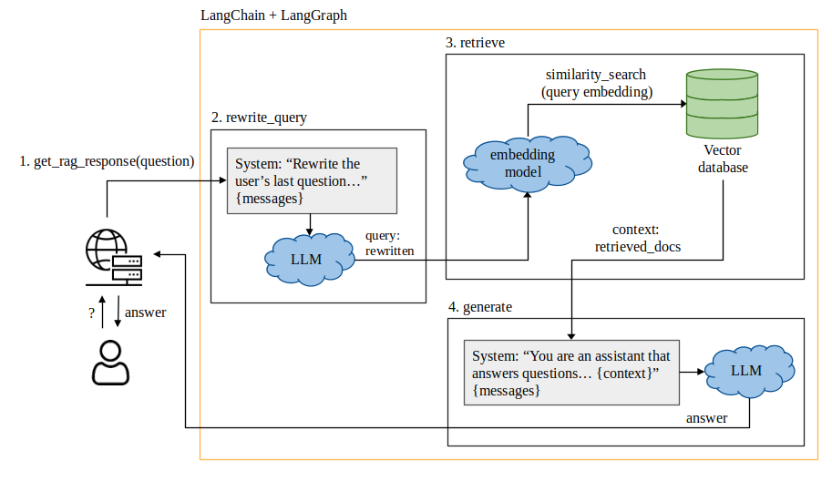

# RAG4MachiningDocs
This repository contains the source code and docs used to implement a RAG pipeline that improves documentation usage of broaching tools.

# Repository structure
The project code is located in the `code` folder, which is organized into three main subfolders:
- `RAG`: Contains the main RAG pipeline for the application, with a separate file for each LLM. The specific LLMs are:
    - `Qwen2.5-7B-Instruct`
    - `Gemma-3-4B-it`
    - `Mistral-7B-Instruct-v0.3`
- `preprocessing`: Contains the scripts used to extract information from the source documents and generate text chunks.
- `Docker`: Contains the files and configuration needed to deploy the web application in a Docker environment.

The code used to carry out automatic evaluations of the system is located in the `evaluation` folder.

The `requirements.txt` file contains the necessary dependencies for the scripts in this repository.

## RAG Architecture
The RAG pipeline is composed of these elements:
- Vector database (Chroma): Stores the documents with their respective embeddings and metadata.
- LLM (Qwen, Mistral or Gemma): Receives the user's question and relevant documents and gives an answer.
- Integration framework (LangChain and LangGraph): Coordinates the RAG pipeline.

The RAG pipeline is composed of three main steps: `rewrite_query`, `retrieve` and `generate`.

- `rewrite_query`: The LLM that generates the answers for the user's questions doesn't have memory of the conversation context. In order to be able to simulate a chat-like conversation between the user and LLM, the list of messages exchanged between them is sent to the LLM with every new question the user sends so that the LLM understands the context. However, the retrieval of the relevant information to answer the user's question is done only with the last message sent by the user. If that question is an incomplete question on its own, because it was derived from the conversation's context, the retrieval might not be good, as the question could be missing important words. That's why we use the `rewrite_query` step. An LLM receives the conversation, reads the last message sent by the user and rewrites it so that it can be a standalone query.

- `retrieve`: The rewritten query is sent to the vector database to retrieve the information that relates most to it. This is done by creating an embedding of the query and performing a similarity search with the documents stored in the database. The most similar documents will be returned.

- `generate`: The list of messages and the retrieved documents are sent to the LLM so that it can answer the user's question based on the information in those documents.